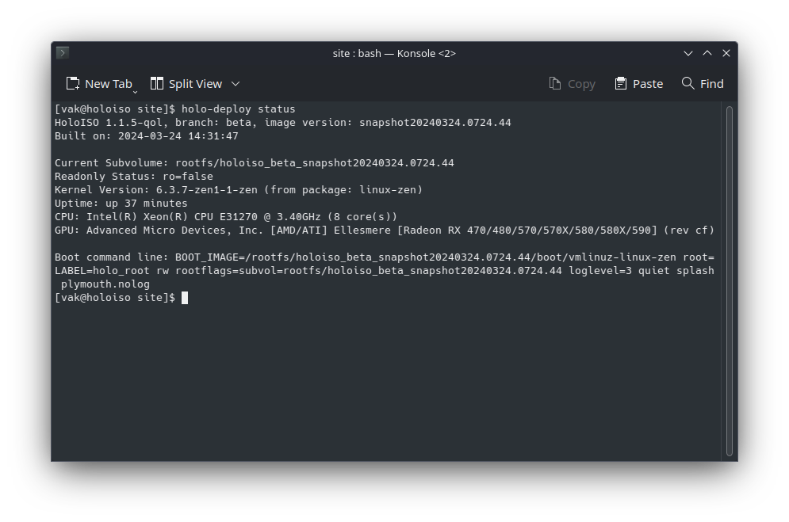
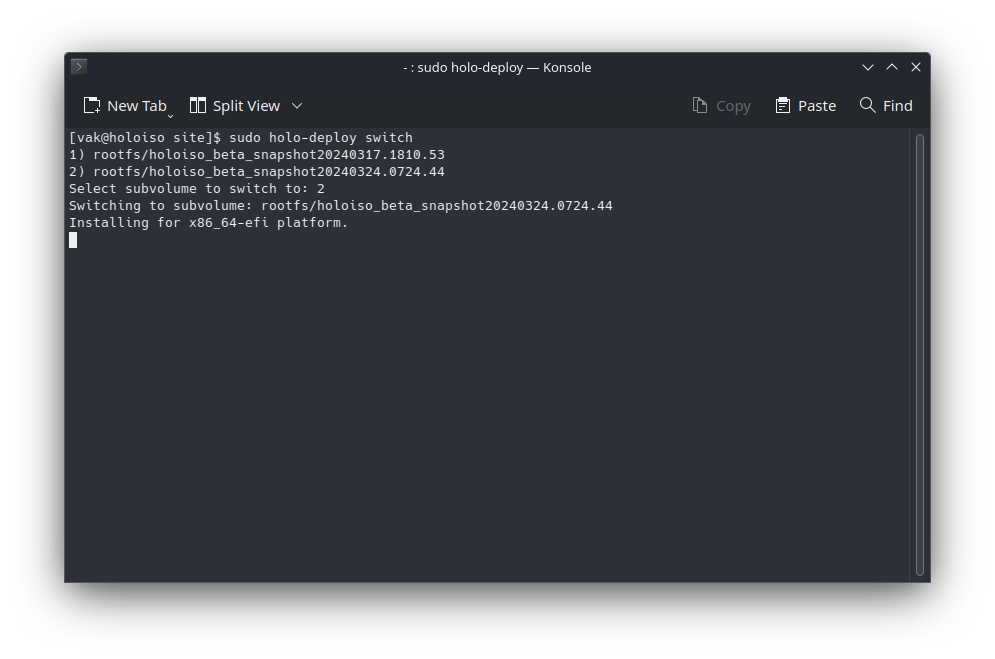

--- 
date: 2024-03-25
categories:
  - OS Updates
  - beta
---

# HoloISO Immutable update 6 version snapshot20240325.1158 build 39 (Branch: beta)

##Changes (Valve side)
### OS
- Update jupiter-hw-support to jupiter-hw-support-20240305.1-2
<!-- more -->

##Changes (HoloISO)

### Update client
- Fixed an issue where update client might not get any argument data due to constant redirects
- Added mirrorfile to define mirror for updateclient in `/etc/steamos-atomupd/mirror`, with an ability to update it using `steamos-update update-mirror`

### OS
- Switched out `linux-zen` for [`linux-lljy`](https://github.com/LLJY/x86-kernel) with numerous Pstate/CPPC fixes, not to mention general upstream improvements
- Added a new tool called `holo-deploy` which does funny stuff:
    - Shows you your current running status:
    
    - Makes you able to switch between subvolumes without any excess effort:
    
    - Ability to install custom subvolumes from `.img.zst` or `.img` files manually via `holo-deploy install blabla.{img.zst;img}`

!!! info "To update..."

    Update via `steamos-update` or the update button inside Deck UI Settings

## Quick notes
### 1)
Hey there!

I just wanted to take a moment to say THANK YOU from the bottom of my heart! Because of your generous donations, we were able to raise enough funds to get ourselves a brand new server to host all of our awesome builds on. I seriously cannot believe how supportive and enthusiastic our community has been throughout this whole process - it truly means the world to me.

We're still debating whether we need a second location, closer to the center of the melting pot called "our glorious mother Earth". But even now, we're were able to ship OVER 5 thousand successful updates since 24 hours of getting our servers!

This new server is going to open up a ton of possibilities for us, allowing us to do even more cool stuff than before. And it's all thanks to each and every one of you who chipped in to make it happen. You guys rock!

So once again, thank you so much for supporting us and helping us bring HoloISO live for everyone!

Cheers,

Adam Jafarov, also known as [@theVakhovske](https://t.me/theVakhovskeIsTaken)

### 2)
As I'm noticing more and more, the builds get more robust and stable each time, which **I'm INCREDIBLY PROUD TO ANNOUNCE** that properly "stable" builds will start to roll out next month, with next week introducing support for release candidates!

Stay tuned for more!
